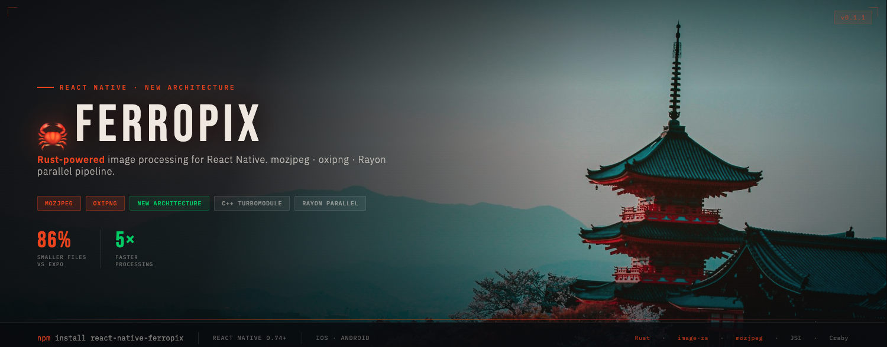

# react-native-ferropix 🦀

[](https://github.com/sairajKalkundre/react-native-ferropix/blob/master/LICENSE)

[](https://www.android.com)
[](https://developer.apple.com/ios)

High-performance React Native image processing powered by Rust.



## Why another image processing library?

Most React Native image libraries process images through platform-specific
layers — ObjCTurboModule on iOS and JavaTurboModule on Android. This adds
overhead on every call. ferropix is a pure C++ TurboModule that talks
directly to Rust via JSI, bypassing both platform layers entirely.

The bigger problem is the encoder. Libraries like expo-image-manipulator
use Android's Bitmap API, which throws away all JPEG structure on decode:

    50MB JPEG → decode to raw Bitmap (loses all JPEG structure)
             → re-encode with Skia (no optimization)
             → 13MB output ❌

ferropix decodes the same file and hands it directly to mozjpeg:

    50MB JPEG → decode to raw pixels
             → mozjpeg (Huffman optimization + chroma subsampling + DCT tuning)
             → 1.8MB output ✅

Same quality setting. 86% smaller. The difference is entirely the encoder.


## Installation
```bash
npm install react-native-ferropix
```
## Requirements

- React Native **0.74+** (New Architecture only)
- For Expo users: SDK 51+ with New Architecture enabled

> ferropix uses React Native's New Architecture (TurboModules) exclusively.
> The Old Architecture (Bridge) is not supported and will not be added.

To enable New Architecture in your project:
```json
// android/gradle.properties
newArchEnabled=true
```
```ruby
# ios/Podfile
ENV['RCT_NEW_ARCH_ENABLED'] = '1'
```
---
## How it works
### Pure C++ TurboModule — no platform bridge overhead

Most React Native libraries go through platform-specific layers:
```
JS → JSI → ObjCTurboModule (iOS) → Native Code
JS → JSI → JavaTurboModule (Android) → Native Code
```

react-native-ferropix bypasses both entirely:
```
JS → JSI → C++ TurboModule → Rust
```

By integrating directly as a pure C++ TurboModule (powered by [Craby](https://craby.rs)),
ferropix skips `ObjCTurboModule` on iOS and `JavaTurboModule` on Android.
The result is lower call overhead and identical behavior on both platforms —
the same Rust code runs everywhere.

### Parallel processing with Rayon

Image operations run in parallel across all available CPU cores using
[Rayon](https://github.com/rayon-rs/rayon), Rust's data parallelism library.
```
Single core:   [pixel 0][pixel 1][pixel 2]...[pixel N]  → sequential
Rayon (8 core): [0..N/8] [N/8..N/4] [N/4..3N/8]...     → parallel
```

On a modern phone with 6-8 cores, pixel operations like resize filters
run 4-6x faster than sequential processing. This is why ferropix can handle
operations that freeze or crash other libraries.

### Memory-safe by design

Rust's ownership model guarantees:
- No null pointer crashes during image decoding
- Automatic memory release after each operation
- Safe handling of images up to 316MP without OOM kills

---
## Architecture overview
```
┌─────────────────────────────────────┐
│         React Native (JS)           │
│   ImageProcessor.load().resize()    │
└──────────────┬──────────────────────┘
               │ JSI (synchronous)
┌──────────────▼──────────────────────┐
│      Pure C++ TurboModule           │
│   (no ObjC/Java bridge layer)       │
└──────────────┬──────────────────────┘
               │ FFI
┌──────────────▼──────────────────────┐
│           Rust Core                 │
│  ┌─────────┐  ┌─────────────────┐  │
│  │ image-rs│  │     Rayon       │  │
│  │ mozjpeg │  │ (parallel ops)  │  │
│  │ oxipng  │  └─────────────────┘  │
│  │  webp   │                       │
│  └─────────┘                       │
└─────────────────────────────────────┘
```

## Usage
```typescript
import { ImageProcessor } from 'react-native-ferropix';

// Simple resize
const result = await ImageProcessor
  .load(filePath)
  .resize({ width: 800, fit: 'cover' })
  .save();

// Full pipeline
const result = await ImageProcessor
  .load(filePath)
  .resize({ width: 1200 })
  .compress({ quality: 85, format: 'webp' })
  .save();

// Flip
const result = await ImageProcessor
  .load(filePath)
  .flip('horizontal')
  .save();
```

## API

### `.load(path: string)`
### `.resize(options: ResizeOptions)`
### `.compress(options: CompressOptions)`
### `.flip(direction: 'horizontal' | 'vertical')`
### `.rotate(degrees: 90 | 180 | 270)`
### `.crop(options: CropOptions)`
### `.save(): Promise<ImageResult>`
